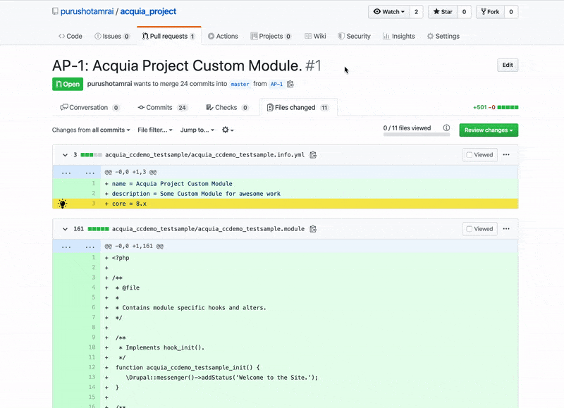

# Code Censor

## Description

Code Censor is a chrome extension to sem-automate PR (Pull Request) Reviews (specific to Drupal for now) to ensure <em>AN INFORMED DECISION</em> is made by human whenever required. No decision is made by the tool.

### This tool is under development and currently is just POC ###

## Help us take next steps: 

* Review/Suggest/Improve the tool: https://forms.gle/xUQLVciFjzc5T1hGA

* Add/Improve test cases: https://forms.gle/NqZnoHLjXHAHXEak9

Test cases are key to success for Code Censor. Code Censor uses these test cases to build dataset for providing reviews/suggestions on Pull Request.

## Steps to install Code Censor

* Clone this repository locally in any folder.
* Visit chrome://extensions/
* Enable Developer Mode (top right)
* Click on Load unpacked and locate the root of the repository.
* Congratulations! Code Censor Extension is installed now.
* Navigate to PR files page and use this tool.

## Features

* Auto-commentor: Click on the review and you get the comment/suggestion ready to be posted as well.
